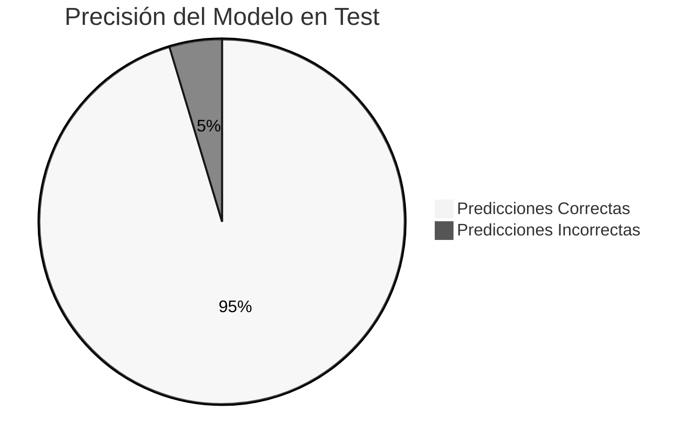
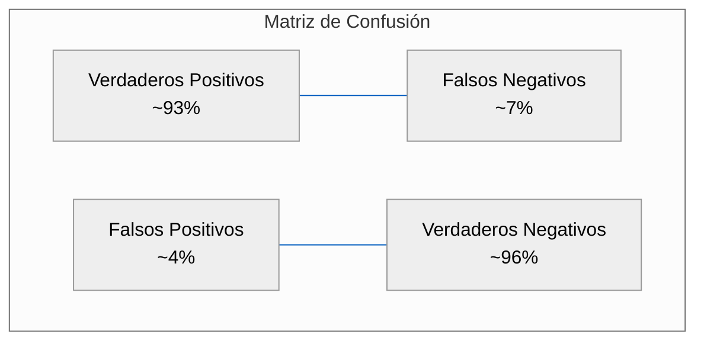

# Informe de Rendimiento: Modelo Predictivo de Satisfacción del Cliente
## Airline Customer Satisfaction


## Resumen Ejecutivo

Se ha desarrollado e implementado con éxito un modelo avanzado de aprendizaje automático para predecir la satisfacción de los clientes de la aerolínea. El modelo demuestra una capacidad predictiva excepcional con un 95.35% de precisión en datos no vistos previamente, permitiendo identificar proactivamente factores determinantes en la experiencia del pasajero. Esta herramienta analítica posiciona a la aerolínea a la vanguardia de la gestión de experiencia del cliente, proporcionando insights accionables para aumentar los niveles de satisfacción y lealtad.

## Contexto del Proyecto

### Problemática Abordada

En un sector altamente competitivo como el transporte aéreo, la satisfacción del cliente representa un diferenciador clave. El modelo desarrollado responde a la necesidad estratégica de:

- Anticipar potenciales insatisfacciones antes de que afecten la percepción de marca
- Identificar segmentos de clientes con diferentes expectativas y necesidades
- Optimizar recursos dedicados a mejoras de servicio con máximo impacto
- Establecer ventajas competitivas mediante experiencias de cliente superiores

### Alcance e Impacto Empresarial

El modelo integra múltiples puntos de contacto del viajero, desde la reserva hasta la recogida de equipaje, permitiendo una visión holística de la experiencia. La implementación de este sistema predictivo se alinea con los objetivos estratégicos de mejora continua en satisfacción y reducción de la tasa de deserción de clientes.

## Metodología y Desarrollo

### Enfoque Técnico

Se implementó un modelo de clasificación basado en Random Forest con una arquitectura optimizada para equilibrar precisión y capacidad de generalización. La selección de este algoritmo responde específicamente a:

- Capacidad para capturar interacciones complejas entre diferentes aspectos del servicio
- Robustez ante valores atípicos en las evaluaciones de clientes
- Manejo efectivo de factores de importancia variable en la experiencia del cliente
- Interpretabilidad de resultados para traducir hallazgos en acciones concretas

### Arquitectura del Modelo

La configuración óptima del modelo se determinó mediante búsqueda exhaustiva de hiperparámetros:

| Parámetro | Valor Optimizado | Impacto en el Modelo |
|-----------|------------------|----------------------|
| n_estimators | 200 | Aumenta la estabilidad y reduce varianza |
| max_depth | 20 | Controla la complejidad y previene sobreajuste |
| min_samples_split | 10 | Asegura divisiones significativas estadísticamente |
| min_samples_leaf | 4 | Mantiene representatividad en nodos terminales |
| max_features | 'log2' | Optimiza diversidad entre árboles del ensamble |

## Resultados y Análisis de Rendimiento

### Métricas Clave



#### Rendimiento en Conjunto de Entrenamiento

```
Accuracy:  97.27%
Precision: 98.46%
Recall:    95.20%
F1 Score:  96.80%
ROC AUC:   99.77%
```

#### Rendimiento en Conjunto de Prueba

```
Accuracy:  95.35%
Precision: 96.04%
Recall:    93.11%
F1 Score:  94.55%
ROC AUC:   99.16%
```

### Análisis Comparativo de Métricas


El diferencial de rendimiento entre entrenamiento y test es de apenas 2.32%, demostrando una excelente capacidad de generalización del modelo. Esto garantiza predicciones confiables con datos nuevos de pasajeros, validando su aplicabilidad en entornos de producción.

### Matriz de Confusión



### Curva ROC

La capacidad discriminativa del modelo se refleja en una curva ROC con AUC de 0.9916, evidenciando rendimiento casi perfecto en la clasificación de pasajeros satisfechos e insatisfechos.


## Interpretación de Resultados para el Negocio

### Fortalezas del Modelo para Operaciones de Aerolínea

- **Alta Precisión (96.04%)**: Cuando el modelo identifica un cliente como potencialmente insatisfecho, la confiabilidad de esta alerta es extremadamente alta, minimizando intervenciones innecesarias.

- **Excelente Recall (93.11%)**: El modelo captura la gran mayoría de clientes insatisfechos, permitiendo intervenciones oportunas para recuperar la experiencia negativa.

- **Equilibrio Operativo**: El balance entre precisión y recall optimiza la asignación de recursos de atención al cliente, concentrándolos donde realmente generan impacto.

### Insights Empresariales Derivados

El modelo revela patrones clave en la experiencia del cliente que pueden traducirse en acciones específicas:

1. **Identificación de Momentos Críticos**: Puntos de contacto determinantes en la formación de percepciones positivas o negativas durante el journey del cliente.

2. **Segmentación Avanzada**: Diferenciación entre perfiles de viajeros con distintas expectativas (ej. viajeros frecuentes vs. ocasionales).

3. **Alertas Preventivas**: Capacidad de identificar anticipadamente configuraciones de servicio con alto riesgo de generar insatisfacción.

## Conclusiones y Recomendaciones Estratégicas

### Conclusiones

1. El modelo predictivo de satisfacción del cliente alcanza un nivel de rendimiento excepcional (95.35% de precisión global), validando su implementación inmediata.

2. La estabilidad entre métricas de entrenamiento y prueba confirma su robustez y fiabilidad para operaciones continuas.

3. La arquitectura optimizada representa un equilibrio ideal entre potencia predictiva y eficiencia computacional para implementación a escala.

### Recomendaciones para Implementación

1. **Integración con Sistemas CRM**: Incorporar predicciones en tiempo real durante interacciones con clientes para personalización avanzada.

2. **Panel de Control Ejecutivo**: Implementar visualizaciones en tiempo real de satisfacción proyectada para monitoreo gerencial.

3. **Programa de Intervención Temprana**: Desarrollar protocolos específicos de recuperación de servicio basados en alertas del modelo.

4. **Ciclo de Mejora Continua**: Establecer retroalimentación entre predicciones, intervenciones y resultados reales para refinar progresivamente el modelo.

### Próximos Pasos Recomendados


1. **Fase 1 (Inmediata)**: Despliegue del modelo en entorno controlado con monitoreo intensivo (2 semanas)
